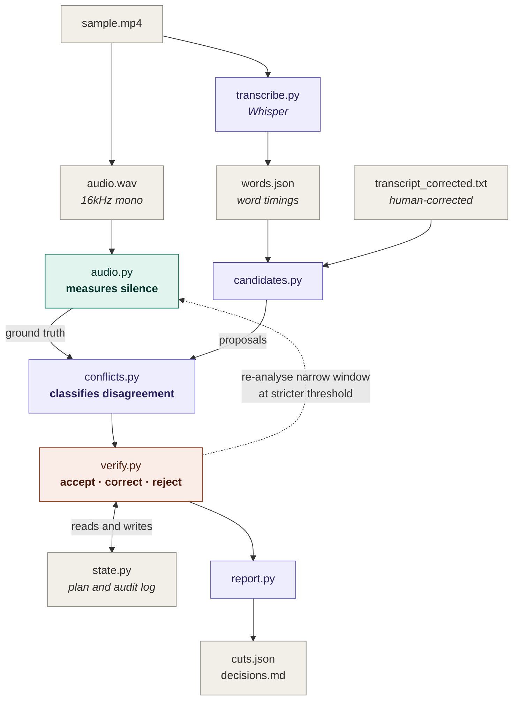

# Cutpoint Agent

Decides where to cut a video into clips by reconciling three disagreeing
sources of evidence: a punctuated transcript, word-level timings from speech
recognition, and direct analysis of the waveform.

## The problem

Punctuation tells you where a sentence *should* end. It does not tell you
whether the speaker actually paused there. Word timings from an ASR model are
an estimate, not a measurement. Only the audio itself is direct evidence.

These three sources disagree constantly, and the disagreements are not noise -
they are the signal. A full stop with no pause behind it usually means the
speaker ran two sentences together. A three-second silence with no punctuation
usually means they hesitated mid-thought. Cutting on either produces a bad clip.

## Resolution principle

> **The transcript decides *whether* a cut belongs somewhere.
> The audio decides *where* it can actually land.**

Semantics propose, acoustics dispose. A proposed cut may be *moved* to nearby
silence, but never *invented* where the waveform gives no support, and never
kept when its semantic justification is absent. Every decision in
[`example_output/decisions.md`](example_output/decisions.md) follows from this
one rule.

## Running it

Requires Python 3.9+ and `ffmpeg` on PATH.

```bash
python -m venv venv && source venv/bin/activate   # Windows: venv\Scripts\activate
pip install -r requirements.txt
python run.py
```

First run downloads the Whisper `base` model (~150MB) and takes a few minutes.

All three inputs can be supplied explicitly:

```bash
python run.py \
  --video sample/sample.mp4 \
  --transcript sample/transcript_corrected.txt \
  --timings output/words.json
```

| Flag | Purpose |
|---|---|
| `--video` | Source video |
| `--transcript` | Punctuated transcript (human-corrected) |
| `--timings` | Word-level timing JSON; generated by Whisper if omitted |
| `--threshold-db` | Silence threshold, default -35 |
| `--skip-asr` | Reuse existing `words.json` |
| `--export-clips` | Split the video at the verified cut points |

Outputs land in `output/`: `cuts.json` (machine-readable) and `decisions.md`
(the full audit log, including rejections). A committed copy of both is in
[`example_output/`](example_output/).

## Architecture


Two edges carry the design. The **dashed line** from `verify.py` back to
`audio.py` is `reanalyse()` - when a silence window is short enough that its
edges may be a threshold artefact, the agent re-measures that specific window
at -40dB rather than guessing. Three of these fire on the sample recording.

The **bidirectional edge** to `state.py` is why decisions are not independent.
Accepting a cut consumes a silence window; later proposals read that state and
can be rejected because of it. 

Note that `audio.py` is called twice in different modes: once over the whole
file to establish ground truth, then repeatedly on narrow windows from inside
the verification loop. It is a tool the agent invokes, not a preprocessing
step.

| Module | Responsibility |
|---|---|
| `src/audio.py` | Waveform analysis. The agent's only source of direct evidence. |
| `src/transcribe.py` | Whisper wrapper producing transcript and timings. |
| `src/candidates.py` | Proposes cuts from transcript and timings, kept separate. |
| `src/conflicts.py` | Classifies disagreements and assigns confidence. |
| `src/verify.py` | Tests each proposal against audio; accepts, corrects, or rejects. |
| `src/state.py` | Shared plan state and append-only audit log. |
| `src/report.py` | Machine and human-readable output. |

Silence detection is a **tool the agent calls**, not a preprocessing step. When
a candidate window is short enough to be ambiguous (<0.50s), the agent
re-analyses that specific window at a stricter threshold rather than guessing.
Three such re-analyses fire on the sample recording.

## Conflict taxonomy

These are the five categories the agent sorts every proposal into.

| Type | Condition | Resolution |
|---|---|---|
| `agreement` | Punctuation inside a silence window | Accept, pad slightly |
| `alignment_drift` | Punctuation within 0.35s of silence | Correct to audio; drift is expected |
| `semantics_without_acoustics` | Punctuation, no silence nearby | Trust audio; reject or re-plan |
| `acoustics_without_semantics` | Silence, no punctuation | Adjacent words decide (see below) |
| `timing_unreliable` | Timing gap the waveform contradicts | Discard |

### Distinguishing hesitation from a missing boundary

The hard case is a long silence with no punctuation. Two possible causes are: the
transcript is missing a mark, or the speaker stalled mid-clause. The agent decides using the word immediately before the silence and the word immediately after it.

The rule relies on asymmetry in English. Speakers almost never *finish* a thought on a function word - "and", "was", "for", "the" and leave sentences grammatically incomplete, so a pause after one is a stall. But they very often *start* a thought with one - "this", "the", "I" all open sentences quite normally.

So the two sides get different word lists. "The" counts as a stall signal when
it comes *before* a silence, but not when it comes *after*. Using one shared
list caused a false positive at 68.21s, where a genuine boundary before "This
next part is..." was misread as hesitation.

Every unexplained silence in the sample recording is bounded by a stall word,
and all five are correctly rejected:

| Time | Duration | Stall word | Side |
|---|---|---|---|
| 33.99s | 5.54s | "was" | before |
| 45.67s | 3.14s | "is" | before |
| 63.04s | 3.07s | "and" | after |
| 99.87s | 3.49s | "but" | before |
| 103.98s | 1.08s | "for" | after |

**The four longest pauses in the recording are all places the agent refuses to
cut.** A system that cut on silence alone would slice five sentences in half.

Two other unexplained silences (59.76s and 68.21s) have content words (nouns, verbs, adjectives...) on both
sides, so they are treated as possible missing punctuation instead - usable,
but at lower confidence than explicit punctuation.

## Findings from the sample recording

The sample was recorded specifically for this project with known conflicts
planted; annotations are in
[`sample/ground_truth_notes.md`](sample/ground_truth_notes.md).

### Word timings cannot locate pauses

Whisper says the word "ship" runs from 31.28s to 36.92s - **5.64 seconds**.
The word takes about a quarter of a second. There was a 5.5s silence there,
and the aligner had nowhere to put it, so it stretched the previous word
across the gap.

This matters because the obvious way to find pauses is to look for gaps
between words (`next.start - current.end`). At the biggest pause in the whole
recording, that gap is **zero**. The words are reported back-to-back. This is
the reason the agent measures the waveform instead of trusting the timings.

The failure can be turned into a signal: any single word longer than 1.5s
means the aligner absorbed a pause. Six words are flagged, and **all six sit
on a real silence window**:

| Flagged word | Duration | Silence found there |
|---|---|---|
| "ship" | 5.64s | 31.22–36.76 |
| "that" | 2.88s | 44.09–47.24 |
| "need" | 2.24s | 50.50–52.66 |
| "and" | 3.58s | 61.50–64.57 |
| "those" | 4.10s | 98.12–101.61 |
| "for" | 1.56s | 103.44–104.52 |

### Picking the silence threshold

Four values were tested:

| Threshold | Windows found | Total silence |
|---|---|---|
| -30 dB | 36 | 63.6s |
| -35 dB | 35 | 59.6s |
| -40 dB | 42 | 54.7s |
| -45 dB | 51 | 29.6s |

The window count goes *up* below -40dB while total silence *halves* - which
looks backwards until you see why. The room's background noise sits around
-42dB. At -45dB that noise keeps crossing the threshold, so one long pause
gets chopped into several short fragments. More windows, less real silence.

-30dB and -35dB give almost the same result, which means the value doesn't
matter much in that range. **-35dB was chosen** for sitting
on it, safely above the noise floor.

Detection also throws out tiny artefacts: a 1.4ms "speech" gap at 3.835s,
caused by a click or similar. The agent merges windows closer than 50ms so a
single pause doesn't appear as two.

### Punctuation lands slightly early, always

Cuts proposed from punctuation land 0.02–0.32s *before* the silence begins,
never after. The reason is simple: the word timestamp marks the last sound of
the word, but the audio takes a moment to fade below the threshold.

Because the error is small and always in the same direction, it's treated as
expected rather than as a conflict. Cuts within 0.35s are moved to the audio
with no confidence penalty.

### Where the cut actually lands

Cuts go at `silence.start + 0.15s`, not the middle of the silence.

Cutting mid-pause sounds sensible but makes bad edits. The full stop at 8.76s
sits inside a 4.75s silence, so the midpoint would be 11.19s - leaving 2.4
seconds of dead air at the end of one clip and another 2.4 seconds at the
start of the next. A short pad keeps a natural breath of space instead.

## Results on the sample

| Metric | Value |
|---|---|
| Proposals evaluated | 26 |
| Confirmed by audio | 4 |
| Corrected to nearby silence | 14 |
| Rejected | 8 |
| Final cut points | 18 |
| Targeted re-analyses | 3 |

Three decisions worth reading in
[`example_output/decisions.md`](example_output/decisions.md):

**112.98s - punctuation with nothing behind it.** The transcript's last full
stop, after "you.", has no silence within 0.75s. Rejected. This is the
principle at its sharpest: the transcript is certain, the audio disagrees, no
cut.

**24.27s - the agent correcting itself backwards.** A semicolon proposed a cut
at 24.70s. The nearest silence had already *ended* by then, 0.17s earlier. At
0.42s that window was short enough to be doubtful, so the agent re-measured
just that region at -40dB, found 0.41s of real silence, and moved the cut
0.43s *backwards* into it. Planned, tested, re-planned.

**54.68s - a strong cut losing to a weak one.** A full stop (0.90 confidence)
was rejected because a comma at 56.66s (0.40 confidence) had already taken the
space, and keeping both would leave a 1.46s clip. This is a flaw, not a
feature - see below.

## Limitations

**Processing order changes the outcome.** Proposals are checked in order of
confidence, but the minimum-clip rule means whichever cut is checked *first*
claims the space. At 54.68s a 0.90-confidence full stop loses to a
0.40-confidence comma that was already accepted. The fix is to look at all
candidates competing for the same region together and keep the strongest,
rather than comparing them one pair at a time. This is the clearest known flaw
in the implementation.

**The hesitation rule is a heuristic.** It gets all five cases right on this
recording, but it's guessing at delivery from word choice. It will fail on
speakers who genuinely do end clauses on prepositions, on slow deliberate
speech, and on languages with different word order. Forced alignment or a
prosodic model would be the real answer.

**Silence detection is sensitive to re-encoding.** Re-encoding the source
video's audio shifted the numbers slightly: one extra 0.26s window appeared
and another grew by 0.12s. No cut decisions changed, but a fixed dB threshold
isn't robust to that. Measuring the noise floor per-file would be.

**The 50ms merge constant is a compromise.** At 67.67–67.78s there's a real
0.11s gap, so one pause stays split across two windows. Raising the constant
would merge it, but risks swallowing genuinely short utterances.

**One speaker, quiet room, no music.** Overlapping speech, background music and
speaker changes are all untested and would probably break the silence
assumption outright.

## What I would do next

**Fix the ordering artefact.** Group candidates competing for the same region
and resolve them jointly by confidence, rather than first-come-first-served.
This is the highest-value fix and probably an hour's work.

**Adaptive silence threshold.** Compute the noise floor from the quietest decile
of frames rather than hardcoding -35dB. This would make the tool work on
recordings other than this one without manual tuning, and would remove the
re-encoding sensitivity described above.

**Export the clips.** The agent produces verified cut points but does not
currently split the video. Adding this is straightforward with ffmpeg, but
`-c copy` splits on keyframes and would drift up to a second from the computed
points; frame-accurate output requires re-encoding, which is a speed/accuracy
tradeoff I would want to make deliberately rather than by default.

**Breath detection.** Breaths are low-energy but not silent, and cutting on one
sounds wrong. The sample contains a deliberate breath at ~72s that is currently
swallowed inside a detected silence window. Spectral analysis would separate
them (Fourier Analysis - looks at the frequencies present in a sound whereas here total loudness was the main thing measured).

**Measure against ground truth.** `sample/ground_truth_notes.md` contains
hand-annotated speech boundaries. Scoring the agent's cut placement against
them - median offset, precision, recall - would turn "it works" into a number.
I ran out of time for this and consider it the most significant gap.

**An LLM adjudicator for genuinely ambiguous cases.** The function-word
heuristic handles the clear cases. For the rest, passing surrounding context to
a language model and asking it to judge hesitation-versus-boundary would likely
outperform lexical rules. The audio check would stay exactly as it is. THe model would only get to propose; the waveform would still decide where the cut can land. So a model that guessed wrong couldn't put a cut somewhere the audio doesn't support.

## Notes on the sample recording

The sample was recorded specifically for this project rather than sourced, so
that ground truth is known. It deliberately contains: sentences run together
with no pause, a 5.5s mid-clause hesitation, a filler-word hesitation, a flatly
read list, an audible breath, and a comma-length pause. Whisper also
mistranscribes "parsing" as "passing", which is left uncorrected in
`output/transcript.txt` - it is honest evidence that ASR output is unreliable,
which is the premise the whole design rests on.

`sample/transcript_corrected.txt` represents a human-corrected transcript: ASR
errors fixed and punctuation adjusted to match intent. This is the realistic
scenario - an editing workflow has a human-authored script on one side and raw
machine timings on the other - and it makes the two sources genuinely
independent artifacts rather than two views of the same Whisper output.